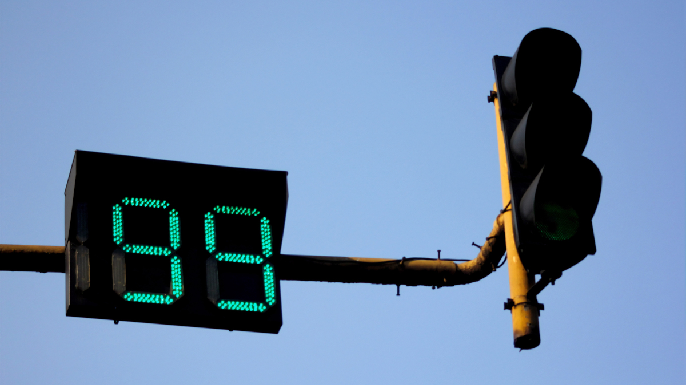

# Intelligent-Traffic-Control-System

 

<h1 align="center">Intelligent Traffic Control System</h1>

<h4></h4>

-----------------------------------------
### Inspiration

x Traffic congestion is becoming one of the critical issues with the increasing population and automobiles in cities. Traffic jams not only cause extra delay and stress for the drivers but also increase fuel consumption and air pollution. 

x Our "Intelligent Traffic Control System" is a comprehensive solution designed to manage and
optimize traffic flow within urban or suburban areas in real-time, using advanced
technologies and data-driven intelligence. The main objective is to continuously adjust the
traffic signal timer based on the varying real-time traffic density and to significantly lessen
traffic congestion.

x Our proposed system uses image processing algorithms, the real-time image data will be
analyzed by the Raspberry Pi and OpenCV, which will determine when to regulate traffic flow.
The intelligent timer reduces vehicle waiting time according to the traffic density and
increases the number of turns granted to cars in each lane to cross the signal, which results
in an improvement in traffic flow.

------------------------------------------
### COMPONENTS

1. `Vehicle Detection Module` - This module is responsible for detecting the number of vehicles in the image received as input from the camera. More specifically, it will provide as output the number of vehicles of each vehicle class such as car, bike, bus, truck, and rickshaw.

2. `Signal Switching Algorithm` - This algorithm updates the red, green, and yellow times of all signals. These timers are set bases on the count of vehicles of each class received from the vehicle detection module and several other factors such as the number of lanes, average speed of each class of vehicle, etc. 

3. `Simulation Module` - A simulation is developed from scratch using [Pygame](https://www.pygame.org/news) library to simulate traffic signals and vehicles moving across a traffic intersection.

------------------------------------------
### Process

* `Vehicle Detection`

 

  

* `Signal Switching Algorithm and Simulation`

------------------------------------------
### License
This project is licensed under the Apache License 2.0 - see the [LICENSE](./LICENSE) file for details.
